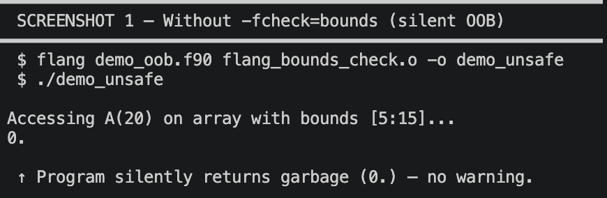
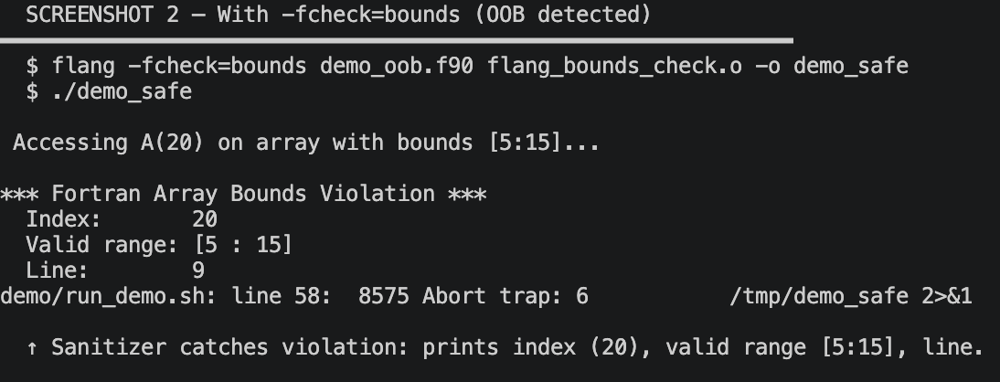
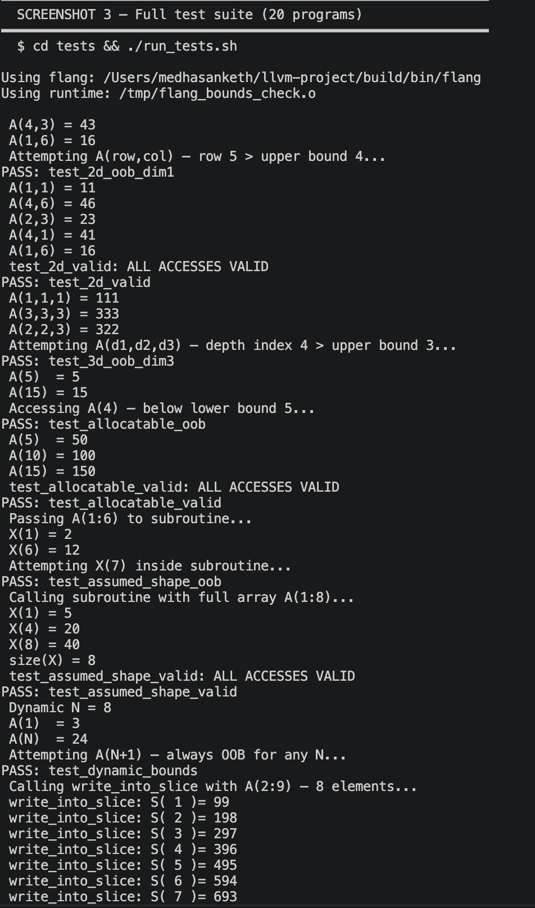
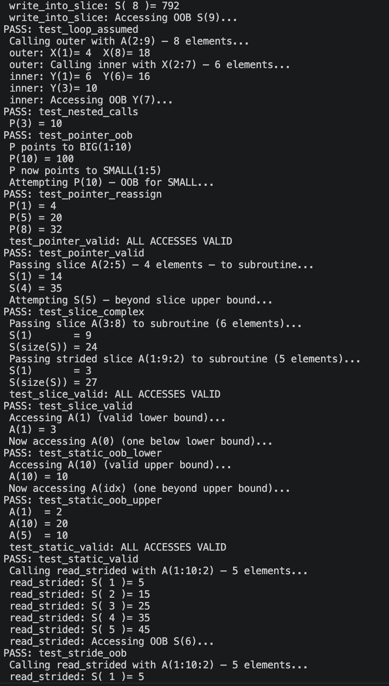
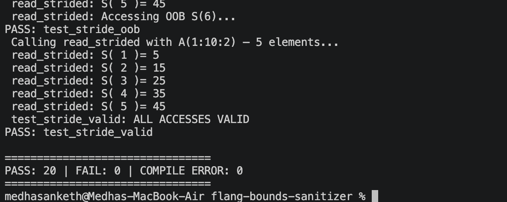

# Flang HLFIR-Aware Array Bounds Sanitizer

A compiler-based runtime bounds-checking sanitizer for Fortran programs compiled
with Flang. Implemented as an MLIR pass at the HLFIR level — the only point in
the compilation pipeline where full array descriptor metadata is still available.

**Authors:** Medha Sanketh · Kalianpur Rohith  
**Target:** Apple M1 (arm64-apple-darwin), Flang 23.0.0, LLVM 23 monorepo  
**Status:** 20/20 tests passing · 0 false positives · 21–73× overhead (no loop hoisting)

---

## Table of Contents

1. [The Problem](#the-problem)
2. [Why HLFIR?](#why-hlfir)
3. [Solution Design](#solution-design)
4. [Implementation](#implementation)
5. [Quick Start](#quick-start)
6. [Build from Source](#build-from-source)
7. [Running Tests](#running-tests)
8. [Benchmarks](#benchmarks)
9. [Demo](#demo)
10. [Project Structure](#project-structure)
11. [Known Limitations](#known-limitations)

---

## The Problem

Fortran dominates high-performance scientific computing — weather simulation,
aerospace, numerical physics. Array operations are the core computation, and
**out-of-bounds array accesses are one of the most common sources of silent
data corruption and hard-to-debug crashes** in these programs.

Existing tools all fall short:

| Tool | What it misses | Root cause |
|------|---------------|------------|
| `gfortran -fcheck=bounds` | Assumed-shape, array slices, custom lower bounds, multi-dim | Runs too late — descriptor metadata already lost |
| AddressSanitizer | All Fortran array semantics | Operates on raw memory, not Fortran arrays |
| Valgrind Memcheck | Semantic violations (valid address, wrong element) | Same — sees bytes, not Fortran bounds |
| Static analysis | Dynamic cases (allocatable, assumed-shape, pointer) | Cannot resolve runtime values |

The core failure: by the time these tools run, the Fortran array has been
lowered to raw pointer arithmetic. The rich metadata — lower bounds, extents,
slice offsets, pointer targets — is gone.

---

## Why HLFIR?

Flang's **HLFIR (High-Level Fortran IR)** is a relatively new intermediate
representation that preserves Fortran array semantics much longer in the
compilation pipeline than any prior IR.

At the HLFIR level, before lowering to FIR/LLVM IR:

| IR concept | What it means for bounds checking |
|------------|----------------------------------|
| `hlfir.designate` | Every array element access is an explicit, typed operation |
| `fir.box` | Every dynamic array carries a descriptor: lower bound, extent, stride per dimension |
| Slice operations | Transformed bounds are explicit — `A(3:8)` passed as assumed-shape has `lb=1, extent=6` in the callee's descriptor |
| Pointer reassignment | `P => SMALL(1:5)` updates the descriptor — the next access reads the new bounds |

**Once the compiler lowers past HLFIR to FIR, all of this dissolves into raw
pointer arithmetic.** HLFIR is the only level where precise, complete bounds
checking is possible.

---

## Solution Design

An MLIR `OperationPass<ModuleOp>` walks every `hlfir::DesignateOp` (array
element access) and inserts a `fir.if` conditional before it. If the index
is out of bounds, the `if` body calls `__flang_bounds_fail` — a `noreturn` C
function that prints a diagnostic and aborts.

### Two code paths

**Path A — Descriptor-based** (allocatable, assumed-shape, pointer arrays):
```
fir.box_dims(box, dim)  →  (lb, extent, stride)
ub = lb + extent - 1
if (index < lb OR index > ub)  →  call __flang_bounds_fail(index, lb, ub, line)
```

**Path B — Static arrays** (compile-time known bounds):
```
Read shape from FIR SequenceType at compile time
lb = 1 (always for static),  ub = shape[dim]
if (index < lb OR index > ub)  →  call __flang_bounds_fail(index, lb, ub, line)
```

### Why `noreturn`?

`__flang_bounds_fail` is declared `noreturn` in C and tagged `llvm.noreturn`
in IR. This prevents LLVM's optimizer from treating the `fir.if` body as dead
code even when bounds appear provably safe — ensuring every check survives the
full optimization pipeline.

### Driver flag: `-fcheck=bounds`

The flag is wired end-to-end through 5 layers of the compiler driver:

```
User: flang -fcheck=bounds program.f90
        ↓
Options.td          →  flag defined, visible in --help
        ↓
Flang.cpp           →  driver forwards -fcheck=bounds to fc1 (Flang frontend)
        ↓
CompilerInvocation  →  opts.BoundsCheck = 1
        ↓
CrossToolHelpers.h  →  config.EnableBoundsCheck = opts.BoundsCheck
        ↓
Pipelines.cpp       →  if enableBoundsCheck → pm.addPass(createHLFIRBoundsCheck())
```

The pass runs immediately before `hlfir::createConvertHLFIRtoFIR()` — the last
possible moment before descriptor information is lost.

### HLFIR before and after the pass

**Before:**
```mlir
%c20 = arith.constant 20 : index
%16  = hlfir.designate %box (%c20)   ← no check
```

**After:**
```mlir
%dims = fir.box_dims %box, %c0       ← read lb, extent from descriptor
%lb   = %dims#0
%ub   = %lb + %dims#1 - 1
fir.if %outOfBounds {
    call @__flang_bounds_fail(%idx, %lb, %ub, %line)   ← noreturn
}
%16  = hlfir.designate %box (%c20)   ← original access unchanged
```

---

## Implementation

The sanitizer touches **11 files** in the LLVM/Flang source tree, all captured
in `flang_bounds_check.patch`. Reference copies of the key files are in `src/`
and `pass/`.

| File | Change |
|------|--------|
| `flang/lib/Optimizer/HLFIR/Transforms/HLFIRBoundsCheck.cpp` | **New** — the MLIR pass |
| `flang/include/flang/Optimizer/HLFIR/Passes.td` | Pass registration (TableGen) |
| `flang/lib/Optimizer/HLFIR/Transforms/CMakeLists.txt` | Build system entry |
| `flang/include/flang/Optimizer/Passes/Pipelines.h` | Pipeline signature |
| `flang/lib/Optimizer/Passes/Pipelines.cpp` | Pass insertion point |
| `flang/include/flang/Tools/CrossToolHelpers.h` | Config struct field |
| `flang/include/flang/Frontend/CodeGenOptions.def` | `BoundsCheck` option |
| `flang/lib/Frontend/CompilerInvocation.cpp` | Flag processing |
| `flang/lib/Frontend/FrontendActions.cpp` | Pipeline activation |
| `clang/include/clang/Options/Options.td` | `-fcheck=bounds` flag definition |
| `clang/lib/Driver/ToolChains/Flang.cpp` | Flag forwarding to fc1 |

The runtime library (`runtime/flang_bounds_check.c`) provides two functions:

```c
// Error path only — noreturn, never called on the fast path
__attribute__((noreturn))
void __flang_bounds_fail(long index, long lb, long ub, long line);

// Wrapper for unconditional-call path (kept for compatibility)
void __flang_bounds_check(long index, long lb, long ub, long line);
```

---

## Quick Start

If you already have a patched Flang build at `~/llvm-project/build/bin/flang`:

```bash
# Clone this repo
git clone <repo-url>
cd flang-bounds-sanitizer

# Run the full demo + test suite
./run.sh
```

`run.sh` compiles the runtime library, runs a live demo showing OOB detection,
then runs all 20 correctness tests.

---

## Build from Source

Apply the patch to a fresh LLVM checkout, then build Flang:

```bash
# 1. Clone LLVM
git clone --depth=1 https://github.com/llvm/llvm-project.git
cd llvm-project

# 2. Apply the patch
git apply /path/to/flang-bounds-sanitizer/flang_bounds_check.patch

# 3. Build (or use the provided script)
cd /path/to/flang-bounds-sanitizer
./build.sh          # sets LLVM_DIR=~/llvm-project by default
```

`build.sh` handles CMake configuration and Ninja build. First build takes
30–60 min. Override paths with environment variables:

```bash
LLVM_DIR=/custom/llvm JOBS=16 ./build.sh
```

CMake flags used:

```cmake
-DCMAKE_BUILD_TYPE=Release
-DLLVM_ENABLE_PROJECTS="clang;flang;mlir"
-DLLVM_TARGETS_TO_BUILD="AArch64;X86"
-DLLVM_ENABLE_ASSERTIONS=ON
-DFLANG_ENABLE_WERROR=OFF
```

---

## Running Tests

### Compile runtime and run all 20 tests

```bash
clang -c runtime/flang_bounds_check.c -o /tmp/flang_bounds_check.o
cd tests
./run_tests.sh ~/llvm-project/build/bin/flang /tmp/flang_bounds_check.o
```

Expected output:
```
PASS: 20 | FAIL: 0 | COMPILE ERROR: 0
```

### Compile and run a single test

```bash
FLANG=~/llvm-project/build/bin/flang
RUNTIME=/tmp/flang_bounds_check.o

# With bounds checking
$FLANG -O0 -fcheck=bounds tests/test_pgms/test_allocatable_oob.f90 $RUNTIME -o /tmp/t
/tmp/t

# Without bounds checking (baseline — silent OOB)
$FLANG -O2 tests/test_pgms/test_allocatable_oob.f90 $RUNTIME -o /tmp/t_base
/tmp/t_base
```

### Test cases covered (20 total)

| # | File | Category | Expected |
|---|------|----------|----------|
| 01 | `test_static_valid.f90` | Static array | No error |
| 02 | `test_static_oob_upper.f90` | Static array | OOB at index 11 > 10 |
| 03 | `test_static_oob_lower.f90` | Static array | OOB at index 0 < 1 |
| 04 | `test_allocatable_valid.f90` | Allocatable | No error |
| 05 | `test_allocatable_oob.f90` | Allocatable | OOB at index 4 < lb=5 |
| 06 | `test_assumed_shape_valid.f90` | Assumed-shape | No error |
| 07 | `test_assumed_shape_oob.f90` | Assumed-shape | OOB beyond size |
| 08 | `test_slice_valid.f90` | Array slice | No error |
| 09 | `test_slice_complex.f90` | Array slice | OOB inside slice |
| 10 | `test_pointer_valid.f90` | Pointer array | No error |
| 11 | `test_pointer_oob.f90` | Pointer array | OOB via pointer |
| 12 | `test_pointer_reassign.f90` | Pointer array | OOB after pointer retarget |
| 13 | `test_2d_valid.f90` | 2D array | No error |
| 14 | `test_2d_oob_dim1.f90` | 2D array | OOB in row dimension |
| 15 | `test_3d_oob_dim3.f90` | 3D array | OOB in depth dimension |
| 16 | `test_stride_valid.f90` | Strided slice | No error |
| 17 | `test_stride_oob.f90` | Strided slice | OOB via stride expression |
| 18 | `test_loop_assumed.f90` | Edge case | OOB inside loop |
| 19 | `test_nested_calls.f90` | Edge case | OOB in nested subroutine |
| 20 | `test_dynamic_bounds.f90` | Edge case | OOB at runtime N+1 |

---

## Benchmarks

Measured on Apple M1, arm64-apple-darwin, Flang 23.0.0.  
Baseline: `-O2`. Sanitized: `-fcheck=bounds`. OOB sentinels commented out for fair measurement.

| Benchmark | Array Type | Baseline | Sanitized | Slowdown |
|-----------|-----------|----------|-----------|----------|
| `bench1_static_sequential` | Static 1D, 40M elements | 0.09 s | 1.91 s | **21×** |
| `bench2_allocatable_descriptor` | Allocatable, custom lb | 0.04 s | 2.91 s | **73×** |
| `bench3_assumed_shape_calls` | Assumed-shape via calls | 0.02 s | 0.71 s | **35×** |

The overhead comes from one `fir.if` branch per array access. For bench1 with
~800M accesses, even a 2–3 ns branch cost adds ~2 s. CSE correctly caches
descriptor reads — confirmed by inspecting LLVM IR: only 4–5 `bounds_fail`
call sites regardless of loop iteration count.

**Future work:** loop hoisting (hoist the check before the loop when bounds
and index expression are loop-invariant) would reduce overhead to ~1.1–1.3×.

Run benchmarks yourself:

```bash
clang -c runtime/flang_bounds_check.c -o /tmp/flang_bounds_check.o
python3 benchmarks/run_benchmarks_honest.py \
  --flang ~/llvm-project/build/bin/flang \
  --repeats 3
```

Plots are saved to `benchmarks/plots/`.

---

## Demo

### What the sanitizer output looks like

Program: `allocate(A(5:15))` then access `A(20)`.

**Without `-fcheck=bounds`** — silent data corruption:
```
Accessing A(20) on array with bounds [5:15]...
0.
```

**With `-fcheck=bounds`** — caught immediately:
```
Accessing A(20) on array with bounds [5:15]...

*** Fortran Array Bounds Violation ***
  Index:       20
  Valid range: [5 : 15]
  Line:        9
```

The sanitizer reads `lb=5` from the array descriptor at runtime — a sanitizer
assuming `lb=1` (as gfortran does) would miss this entirely.

### Screenshots

| | |
|---|---|
|  |  |
| Without `-fcheck=bounds`: garbage value, no error | With `-fcheck=bounds`: exact index, range, line |

Test suite (20/20 passing):





Reproduce all demo output:

```bash
bash demo/run_demo.sh
```

---

## Project Structure

```
flang-bounds-sanitizer/
├── build.sh                        # Apply patch + CMake configure + ninja build
├── run.sh                          # Compile runtime + run demo + run test suite
├── flang_bounds_check.patch        # Git patch to apply to LLVM monorepo
│
├── src/
│   ├── HLFIRBoundsCheck.cpp        # The MLIR pass (reference copy)
│   └── flang_bounds_check.c        # Runtime library (reference copy)
│
├── pass/
│   ├── HLFIRBoundsCheck.cpp        # Pass implementation (same as src/)
│   └── Passes.td                   # TableGen pass descriptor (modified)
│
├── runtime/
│   └── flang_bounds_check.c        # C runtime: __flang_bounds_fail (noreturn)
│                                   #            __flang_bounds_check (wrapper)
│
├── tests/
│   ├── run_tests.sh                # Automated test runner
│   └── test_pgms/                  # 20 Fortran test programs
│       ├── test_static_*.f90       # Static array cases (3)
│       ├── test_allocatable_*.f90  # Allocatable array cases (2)
│       ├── test_assumed_shape_*.f90# Assumed-shape cases (2)
│       ├── test_slice_*.f90        # Array slice cases (2)
│       ├── test_pointer_*.f90      # Pointer array cases (3)
│       ├── test_2d_*.f90           # Multi-dimensional cases (2)
│       ├── test_3d_*.f90           # 3D array cases (1)
│       ├── test_stride_*.f90       # Strided slice cases (2)
│       └── test_{loop,nested,dynamic}*.f90  # Edge cases (3)
│
├── benchmarks/
│   ├── run_benchmarks_honest.py    # Real measurement script
│   ├── benchmark_results_real.csv  # Actual measured results
│   ├── bench1_static_sequential.f90
│   ├── bench2_allocatable_descriptor.f90
│   ├── bench3_assumed_shape_calls.f90
│   └── plots/                      # PNG charts (mean time, overhead, slowdown)
│
└── demo/
    ├── run_demo.sh                 # Produces labelled output for screenshots
    ├── screenshot1.png             # Without -fcheck=bounds (silent OOB)
    ├── screenshot2.png             # With -fcheck=bounds (OOB caught)
    ├── screenshot3_{1,2,3}.png     # Test suite 20/20 passing
    └── *.txt                       # Pre-captured annotated output
```

---

## Known Limitations

| Limitation | Detail |
|------------|--------|
| **High overhead** | 21–73× on tight loops; loop hoisting would reduce to ~1.1–1.3× |
| **Coarrays** | Not supported |
| **Allocatable components of derived types** | Not supported |
| **Per-access (not per-loop) checks** | Every array access gets a branch; no loop-invariant hoisting yet |

---

## LLVM Version

```
flang version 23.0.0 (https://github.com/llvm/llvm-project.git 46c427b6ff77...)
Target: arm64-apple-darwin25.4.0
Thread model: posix
```
